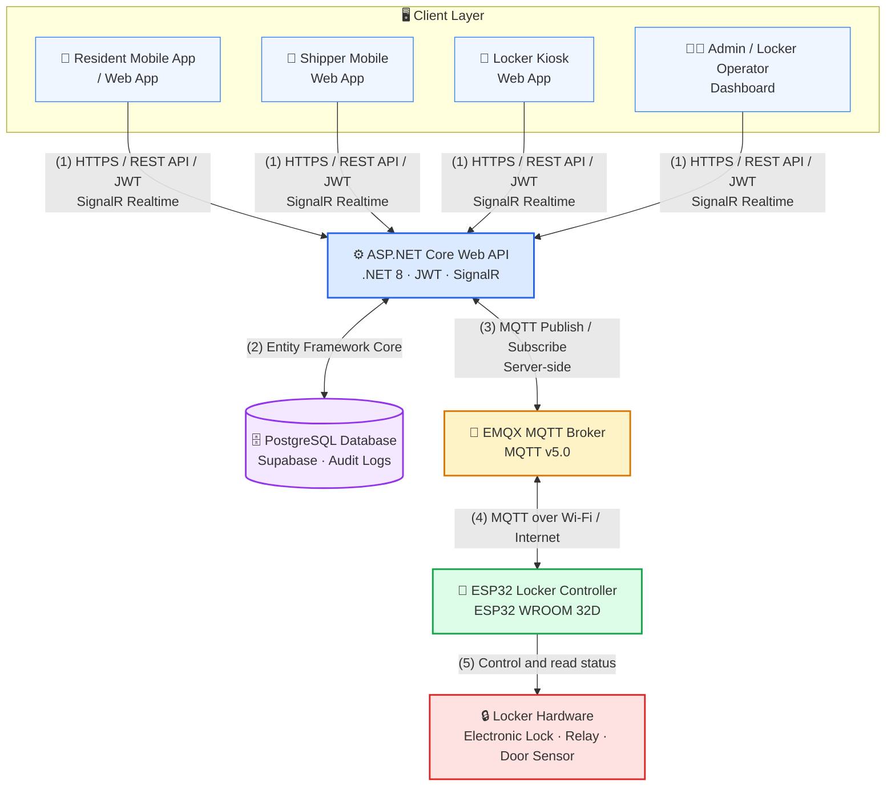

<p align="center">
  
</p>

<p align="center">
  
</p>

<p align="center">
  <strong>Language:</strong>
  <a href="./README.vn.md">🇻🇳 Tiếng Việt</a>
  &nbsp;|&nbsp;
  <a href="./README.md">🇬🇧 English</a>
</p>

<h3 align="center">
  🖥️ Web Frontend for SDLMS
</h3>

<p align="center">
  A smart parcel delivery management platform with real-time connectivity and IoT integration.
</p>

<p align="center">
  
  
  
  
  
  
</p>

<p align="center">
  <a href="#quick-start"></a>
  <a href="#tech-stack"></a>
  <a href="#architecture"></a>
  <a href="#related-repositories"></a>
  <a href="#development-team"></a>
</p>

## Overview

`smart-locking-fe` is the Web frontend of the Boxora system, providing user interfaces for Administrators, Locker Operators, Residents, Shippers.

### Main Interfaces

* **Admin Dashboard** — manages and configures the entire system.
* **Locker Operator Dashboard** — monitors lockers and handles operational tasks.
* **Shipper Guest Web App** — allows parcel drop-off without account registration.
* **Resident Web App** — allows residents to manage and retrieve their parcels.
* **Locker Kiosk** — a touch-optimized interface used directly at the locker.

---

<a id="quick-start"></a>

<details open>
<summary><strong>🚀 Quick Start</strong></summary>

### Requirements

* Node.js:
* Package manager:

### Installation

```bash
git clone https://github.com/se-05-sdlms/smart-locking-fe
cd smart-locking-fe
```

### Configuration

```bash
```

### Run the Development Environment

```bash
# TO BE FILLED IN from the scripts section in package.json
<DEV_COMMAND>
```

* Local URL: your localhost URL
* Demo URL: to be updated

</details>

<a id="tech-stack"></a>

<details open>
<summary><strong>🧰 Tech Stack</strong></summary>

| Category         | Technology                    |
| ---------------- | ----------------------------- |
| Framework        | React 18                      |
| Build tool       | Vite 5.x                      |
| Styling          | Tailwind CSS 4, shadcn/ui     |
| State & realtime | Zustand, `@microsoft/signalr` |
| API & cache      | Axios, TanStack Query 5       |
| Routing          | React Router DOM 6.x          |

</details>

<a id="architecture"></a>

<details open>
<summary><strong>🏗️ Architecture</strong></summary>



The frontend communicates only with the backend API and SignalR Hub. It does not connect directly to the database, MQTT Broker, or ESP32 devices.

</details>

<details open>
<summary><strong>🔐 Environment Variables</strong></summary>

Create a `.env` file from the project's example environment file.

```env
# TO BE FILLED IN using the exact variable names from the source code
VITE_API_BASE_URL=
VITE_SIGNALR_HUB_URL=
```

Do not store real secrets in the frontend or commit the `.env` file to Git.

</details>

<details>
<summary><strong>🧪 Build, Test, and Lint</strong></summary>

```bash
# TO BE FILLED IN from package.json
<BUILD_COMMAND>
<TEST_COMMAND>
<LINT_COMMAND>
<E2E_COMMAND>
```

</details>

<details>
<summary><strong>📁 Project Structure</strong></summary>

```text
smart-locking-fe/
├── docs/
│   └── images/
│       └── readme-header.png
├── src/
├── public/
├── .env.example
├── package.json
├── README.vn.md
└── README.md
```

</details>

<a id="related-repositories"></a>

<details open>
<summary><strong>🔗 Related Repositories and Documentation</strong></summary>

| Component               | Link                                                                                                 |
| ----------------------- | ---------------------------------------------------------------------------------------------------- |
| GitHub Organization     | [se-05-sdlms](https://github.com/se-05-sdlms)                                                        |
| Backend                 | [smart-locking-be](https://github.com/se-05-sdlms/smart-locking-be)                                  |
| Mobile                  | [smart-locking-mobile](https://github.com/se-05-sdlms/smart-locking-mobile)                          |
| Project Documentation | [Google Drive](https://drive.google.com/drive/folders/1M3OPsm2NxAi7WnAfsKgV4MQEMRy5rOsa?usp=sharing) |

</details>

<a id="development-team"></a>

<details open>
<summary><strong>👥 Development Team</strong></summary>

* **Project code:** `SDLMS`
* **Group:** `SE_05`

### Supervisor

| Full name             | Role       | Email                                       |
| --------------------- | ---------- | ------------------------------------------- |
| MSc. Lê Thị Bích Tra  | Supervisor | [traltb@fe.edu.vn](mailto:traltb@fe.edu.vn) |

### Members

| Student ID | Full name             | Role        | Email                                                             |
| ---------- | --------------------- | ----------- | ----------------------------------------------------------------- |
| DE180519   | Nguyễn Phan Huy       | Team Leader | [huynpde180519@fpt.edu.vn](mailto:huynpde180519@fpt.edu.vn)       |
| DE180405   | Phan Thành Vương      | Member      | [vuongptde180405@fpt.edu.vn](mailto:vuongptde180405@fpt.edu.vn)   |
| DE180313   | Võ Văn Hài            | Member      | [haivvde180313@fpt.edu.vn](mailto:haivvde180313@fpt.edu.vn)       |
| DE180393   | Trần Minh Cường       | Member      | [cuongtmde180393@fpt.edu.vn](mailto:cuongtmde180393@fpt.edu.vn)   |
| DE181072   | Trương Hà Thùy Trang  | Member      | [trangthtde181072@fpt.edu.vn](mailto:trangthtde181072@fpt.edu.vn) |

</details>
