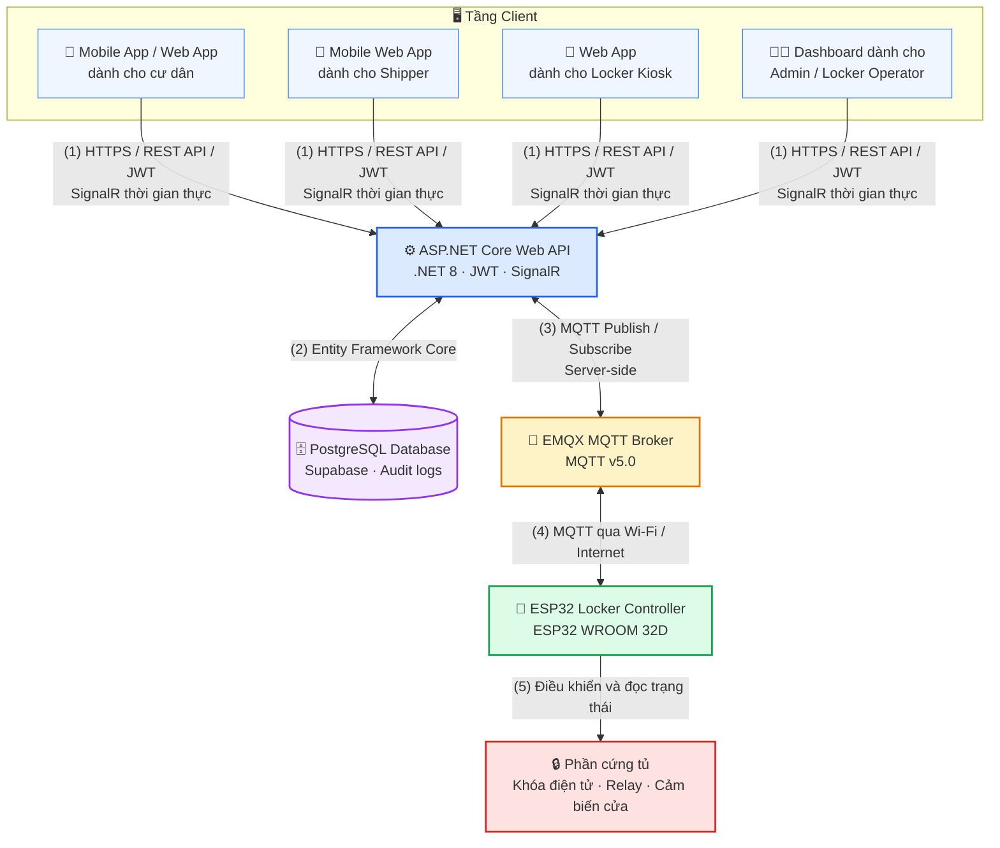

<p align="center">
  
</p>

<p align="center">
  
</p>

<p align="center">
  <strong>Ngôn ngữ:</strong>
  <a href="./README.md">🇻🇳 Tiếng Việt</a>
  &nbsp;|&nbsp;
  <a href="./README.en.md">🇬🇧 English</a>
</p>

<h3 align="center">
  🖥️ Web Frontend của SDLMS
</h3>

<p align="center">
  Nền tảng quản lý giao nhận bưu kiện thông minh, kết nối thời gian thực và tích hợp IoT.
</p>

<p align="center">
  
  
  
  
  
  
</p>

<p align="center">
  <a href="#quick-start"></a>
  <a href="#tech-stack"></a>
  <a href="#architecture"></a>
  <a href="#related-repositories"></a>
  <a href="#development-team"></a>
</p>

## Tổng quan

`smart-locking-fe` là frontend Web của hệ thống Boxora, cung cấp giao diện cho Quản trị viên, Locker Operator, Cư dân, Shipper.

### Các màn hình chính

* **Dashboard quản trị** — quản trị và cấu hình toàn bộ hệ thống.
* **Dashboard dành cho Locker Operator** — giám sát tủ và xử lý vận hành.
* **Web App khách dành cho Shipper** — gửi bưu kiện không cần đăng ký tài khoản.
* **Web App dành cho cư dân** — quản lý và nhận bưu kiện của cư dân.

---

<a id="quick-start"></a>

<details open>
<summary><strong>🚀 Bắt đầu nhanh</strong></summary>

### Yêu cầu

* Node.js:
* Trình quản lý package:

### Cài đặt

```bash
git clone https://github.com/se-05-sdlms/smart-locking-fe
cd smart-locking-fe
```

### Cấu hình

```bash
```

### Chạy môi trường phát triển

```bash
# NGƯỜI DÙNG CẦN ĐIỀN từ scripts trong package.json
<DEV_COMMAND>
```

* URL local: localhost của bạn
* URL demo: cập nhật sau

</details>

<a id="tech-stack"></a>

<details open>
<summary><strong>🧰 Công nghệ</strong></summary>

| Nhóm             | Công nghệ                     |
| ---------------- | ----------------------------- |
| Framework        | React 18                      |
| Build tool       | Vite 5.x                      |
| Styling          | Tailwind CSS 4, shadcn/ui     |
| State & realtime | Zustand, `@microsoft/signalr` |
| API & cache      | Axios, TanStack Query 5       |
| Routing          | React Router DOM 6.x          |

</details>

<a id="architecture"></a>

<details open>
<summary><strong>🏗️ Kiến trúc</strong></summary>



Frontend chỉ giao tiếp với backend API và SignalR Hub. Frontend không kết nối trực tiếp tới database, MQTT Broker hoặc thiết bị ESP32.

</details>

<details open>
<summary><strong>🔐 Biến môi trường</strong></summary>

Tạo file `.env` từ file mẫu của dự án.

```env
# NGƯỜI DÙNG CẦN ĐIỀN đúng tên biến từ mã nguồn
VITE_API_BASE_URL=
VITE_SIGNALR_HUB_URL=
```

Không lưu secret thật trong frontend hoặc commit file `.env` lên Git.

</details>

<details>
<summary><strong>🧪 Build, test và lint</strong></summary>

```bash
# NGƯỜI DÙNG CẦN ĐIỀN từ package.json
<BUILD_COMMAND>
<TEST_COMMAND>
<LINT_COMMAND>
<E2E_COMMAND>
```

</details>

<details>
<summary><strong>📁 Cấu trúc dự án</strong></summary>

```text
smart-locking-fe/
├── docs/
│   └── images/
│       └── readme-header.png
├── src/
├── public/
├── .env.example
├── package.json
├── README.en.md
└── README.md
```

</details>

<a id="related-repositories"></a>

<details open>
<summary><strong>🔗 Repo và tài liệu liên quan</strong></summary>

| Thành phần           | Liên kết                                                                                             |
| -------------------- | ---------------------------------------------------------------------------------------------------- |
| GitHub Organization  | [se-05-sdlms](https://github.com/se-05-sdlms)                                                        |
| Backend              | [smart-locking-be](https://github.com/se-05-sdlms/smart-locking-be)                                  |
| Mobile               | [smart-locking-mobile](https://github.com/se-05-sdlms/smart-locking-mobile)                          |
| Tài liệu dự án | [Google Drive](https://drive.google.com/drive/folders/1M3OPsm2NxAi7WnAfsKgV4MQEMRy5rOsa?usp=sharing) |

</details>
<a id="development-team"></a>
<details open>
<summary><strong>👥 Nhóm phát triển</strong></summary>

* **Mã dự án:** `SDLMS`
* **Nhóm:** `SE_05`

### Giảng viên hướng dẫn

| Họ và tên            | Vai trò              | Email                                       |
| -------------------- | -------------------- | ------------------------------------------- |
| ThS. Lê Thị Bích Tra | Giảng viên hướng dẫn | [traltb@fe.edu.vn](mailto:traltb@fe.edu.vn) |

### Thành viên

| MSSV     | Họ và tên            | Vai trò     | Email                                                             |
| -------- | -------------------- | ----------- | ----------------------------------------------------------------- |
| DE180519 | Nguyễn Phan Huy      | Trưởng nhóm | [huynpde180519@fpt.edu.vn](mailto:huynpde180519@fpt.edu.vn)       |
| DE180405 | Phan Thành Vương     | Thành viên  | [vuongptde180405@fpt.edu.vn](mailto:vuongptde180405@fpt.edu.vn)   |
| DE180313 | Võ Văn Hài           | Thành viên  | [haivvde180313@fpt.edu.vn](mailto:haivvde180313@fpt.edu.vn)       |
| DE180393 | Trần Minh Cường      | Thành viên  | [cuongtmde180393@fpt.edu.vn](mailto:cuongtmde180393@fpt.edu.vn)   |
| DE181072 | Trương Hà Thùy Trang | Thành viên  | [trangthtde181072@fpt.edu.vn](mailto:trangthtde181072@fpt.edu.vn) |
